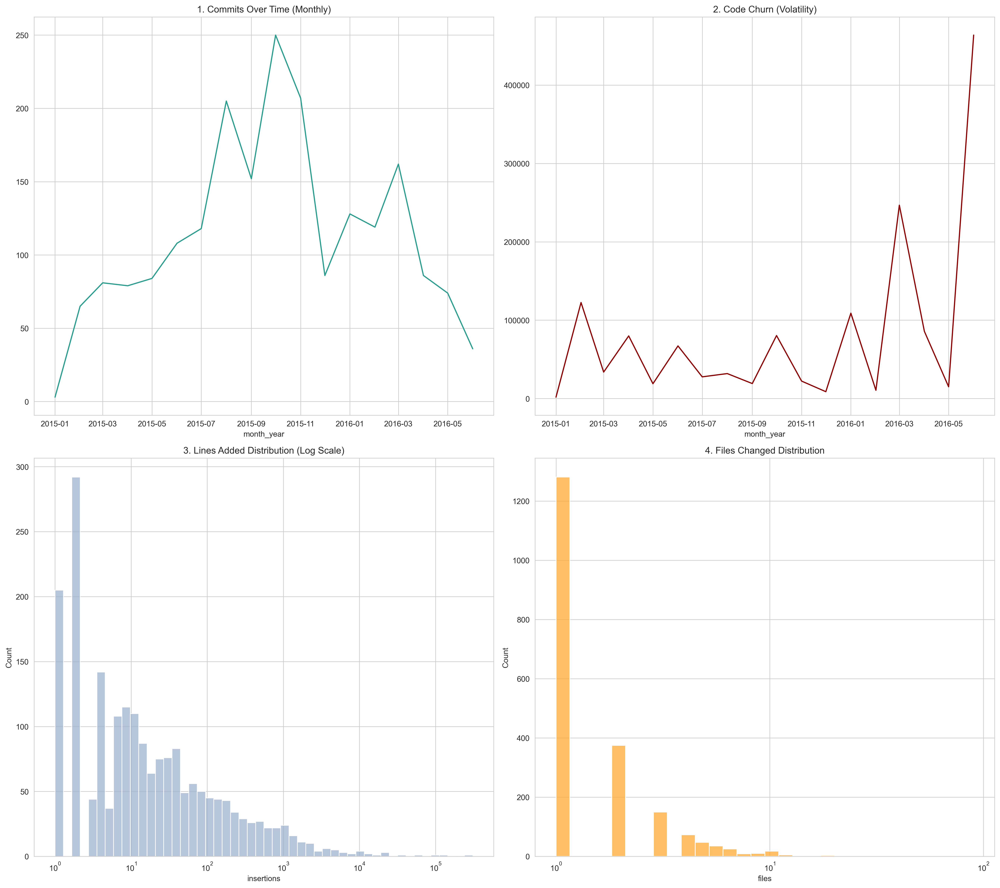

# Repository Maturation & Disturbance Signals

To contextualize AI artifact probabilities, we must evaluate base developmental temporal clusters that could otherwise be misidentified by our `DistilBERT` generator pipelines. Because models like GPT tend to hallucinate large, sweeping changes or generate very narrow robotic files, understanding chronological growth is paramount to creating accurate ML cutoff pipelines.

## 4.1.1 Commits Over Time (Monthly)
*Top Left Graph*

Commit activity follows a maturation cycle: early growth during foundational development, followed by a plateau as the codebase stabilized. Periodic spikes reflect major releases or architectural updates, while recent data indicates renewed intensity tied to ecosystem expansion.

**Interpretation:** Temporal clustering of commits must be accounted for when analyzing AI-generated code signals, as high-activity periods may bias detection outcomes.

---

## 4.1.2 Code Churn (Volatility)
*Top Right Graph*

Code churn demonstrates significant temporal volatility throughout the repository lifecycle. Early development phases show moderate churn consistent with stabilization efforts, while mid-project periods exhibit extreme spikes indicative of major refactoring. Sustained high-churn intervals suggest architectural restructuring phases. Recent increases in churn may reflect modernization efforts or large-scale feature expansion.

**Interpretation:** High churn periods may distort AI detection signals; refactoring-heavy commits should be filtered to reduce misclassification risk.

---

## 4.1.3 Lines Added Distribution (Log Scale)
*Bottom Left Graph*

The distribution of lines added per commit is heavily right-skewed, with the majority of commits introducing a small number of lines. A long tail extends toward very large insertions representing bulk code additions. Log scaling reveals density within small-to-medium sized commits that would otherwise be obscured. Overall, development predominantly occurs through incremental edits rather than large rewrites. Extreme outliers correspond to feature drops, refactors or dependency integrations.

**Interpretation:** Large insertion commits are strong candidates for AI-assisted generation analysis and may require threshold-based filtering to avoid skewed inference.

---

## 4.1.4 Files Changed Distribution
*Bottom Right Graph*

Most commits modify a single file, indicating localized development behavior. The distribution declines steeply as the number of modified files increases, forming a long-tail pattern. Although multi-file commits occur, they are substantially less frequent. Rare high-file-count commits typically correspond to system-wide refactors or coordinated feature rollouts.

**Interpretation:** Single-file commits likely reflect incremental human workflows, whereas multi-file commits may correlate with broader implementations potentially involving AI assistance.
