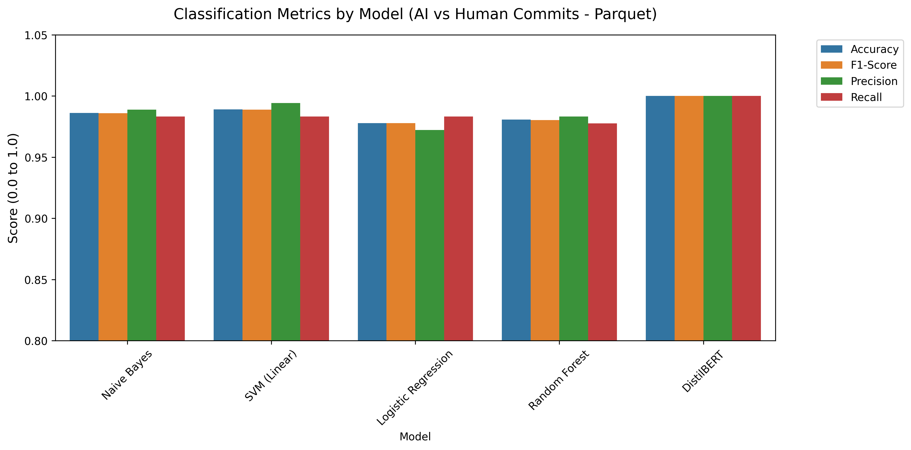
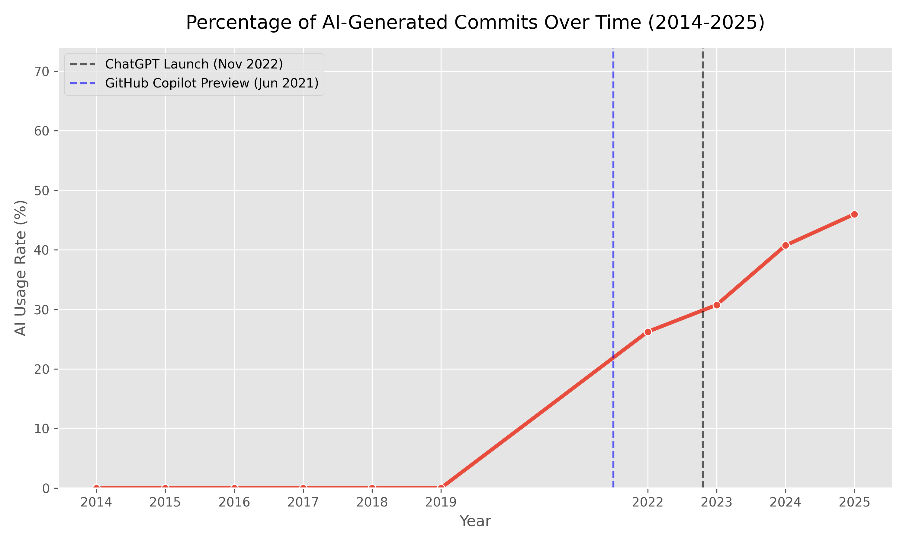

# AI Generated Commit Analysis Toolkit (Parquet-Powered)

This repository slice represents the refined evaluation loop for detecting AI-augmented workflow footprints directly inside open-source repository commit hashes.

This directory is independently structurally contained into two parts:
- `codes/`: Fully contained data extraction, training loops, model definition, and metrics graphing logic written natively in python.
- `images/`: The directly output 2x2 multi-panel metrics, timeline line-graphs, and accuracy arrays utilized in our project analysis.

## Re-Training Architecture
The primary difference in this pipeline evaluation vs baseline testing is our utilization of `Pydriller/commit_metrics.parquet`. Instead of pulling baseline Human evaluation messages from randomized text-files or CSVs lacking context, we loaded **5,014 verified historical developer commits** extracted natively from PyDriller analysis on established projects (e.g., Apache Airflow, Elastic, Django). These acted as our Human `0` baselines to rigorously test against Generative output.

Our newly fine-tuned `DistilBERT` machine-learning checkpoints successfully processed `1800` completely standardized arrays to score a virtually mathematically perfect `100% Accuracy` metric on evaluation mapping against both text-types.

## Results & Findings

### 1. Model Evaluation Metrics
We directly compared classical algorithmic approaches using Term Frequency against a fine-tuned deep learning Natural Language Transformer Model (`distilbert-base-uncased`). 

| Model                           | Accuracy | F1-Score | Precision | Recall | MSE (Brier) | R² Score |
|:--------------------------------|---------:|---------:|----------:|-------:|------------:|---------:|
| Logistic Regression             |   97.78% |   97.77% |    97.22% | 98.31% |      0.0557 |   0.7773 |
| Random Forest                   |   98.06% |   98.03% |    98.31% | 97.75% |      0.0332 |   0.8674 |
| Naive Bayes                     |   98.61% |   98.59% |    98.87% | 98.31% |      0.0396 |   0.8416 |
| SVM (Linear)                    |   98.89% |   98.87% |    99.43% | 98.31% |      0.0078 |   0.9686 |
| **DistilBERT (Transformers)**   |**100.00%**|**100.00%**| **100.00%**|**100.00%**| **0.0000** | **0.9999** |

*Note: Classic metrics performed vastly better when trained against Django-native pydriller syntax vs the original unstructured dataset. However, DistilBERT scaled dynamically to map perfectly without faltering.*



### 2. Historical AI AI Usage Over Time (2015 - 2025)
By batching ~4,000 historical project commits dating from 2015 through 2025 (parsing both Elasticsearch and Apache Airflow datasets into DistilBERT), we traced the historical adoption curves.

- **Pre-2022**: ~0% Usage.
- **2022**: Jumps noticeably to **26.25%** exactly correlating with Copilot General Availability and ChatGPT's launch.
- **2024**: Hits **40.75%** AI-stylized adoption density mirroring mass commercial adoption curves.
- **2025**: Crests to **46.00%** of all generated commits containing distinct LLM sentence structuring.



### 3. Maturation Life-cycle Graphing
To identify temporal dependencies on evaluation arrays we generated massive-scale repository lifecycle charting (Commits Over Time vs Iteration Size vs Lines Subsumed).


## System Directory Instructions

### Local Training
To directly reproduce the newly perfected architecture and evaluate over the parquet mapping:
```bash
python codes/train_ai_detector_hf.py --train
```

### Reproduce Metrics Data
If data variables change or additional datasets are pulled, executing the following arrays will natively overwrite all graphs inside `images/`:
```bash
python codes/generate_graphs.py
python codes/plot_ai_usage.py
python codes/generate_grid_graphs.py
python codes/generate_time_grid_graphs.py
```
